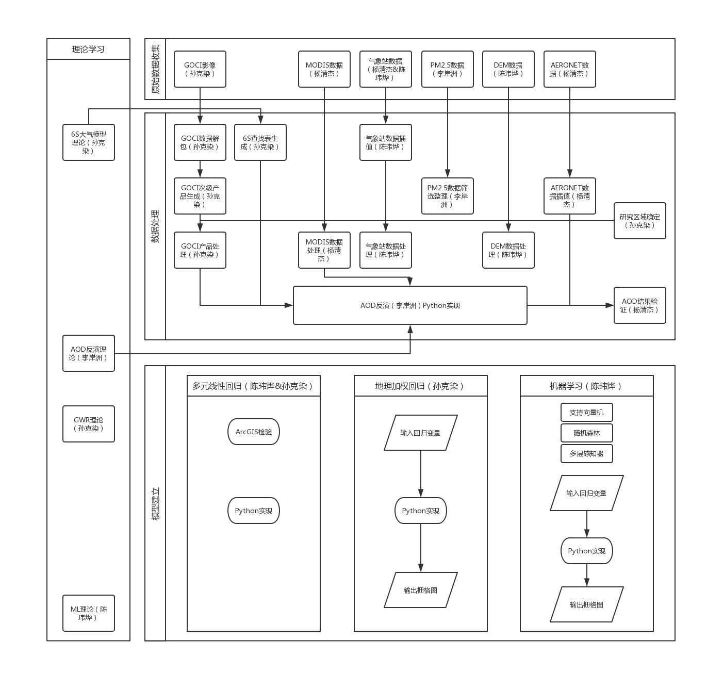
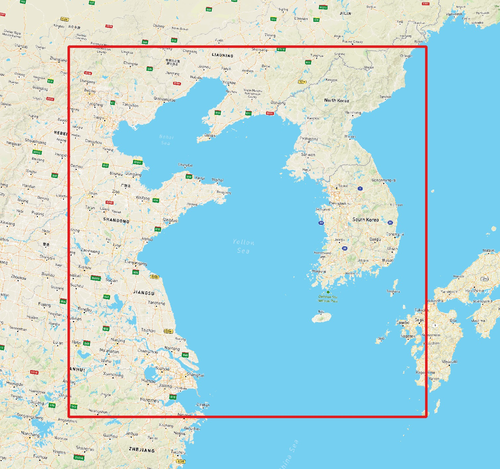

# 中韩 PM2.5 传导关系研究

> 研究区域：GOCI卫星得到的韩国、中国东北部沿海、黄海等海域
> 
> 研究时间：2019年2月底到3月中旬，短时间内密集采样

项目组成员：陈玮烨 孙克染 李岸洲 杨清杰

## 项目构成

### 站内导航快速链接

1. 项目主页：https://github.com/MarvelousRC/FactCheckSKoreanAirPollution
2. 基础数据收集和预处理：[https://github.com/MarvelousRC/FactCheckSKoreanAirPollution/blob/master/基础数据的获取和处理.md](https://github.com/MarvelousRC/FactCheckSKoreanAirPollution/blob/master/基础数据的获取和处理.md)
   * 气象数据预处理：[LINK](https://github.com/MarvelousRC/FactCheckSKoreanAirPollution/blob/master/基础数据的获取和处理.md#三气象输数据的预处理)
   * AOD反演原理和验证：[LINK](https://github.com/MarvelousRC/FactCheckSKoreanAirPollution/blob/master/基础数据的获取和处理.md#四光学气溶胶厚度aod的反演)
3. 多元线性回归、建模探索：https://github.com/MarvelousRC/FactCheckSKoreanAirPollution/blob/master/ML/MLR.ipynb （Jupyter Notebook文档报告）
4. GWR模型实现：https://github.com/MarvelousRC/FactCheckSKoreanAirPollution/blob/master/GTWR/advanced_gtwr.py
5. 机器学习模型实现：https://github.com/MarvelousRC/FactCheckSKoreanAirPollution/blob/master/ML/PM25_Machine_Learning_Experiment.ipynb（Jupyter Notebook文档报告）
   * 数据预处理、参数优化以及交叉验证说明
   * 预测分析和图示
6. 结果说明（见报告）

## 项目研究范围

##### 空间范围

空间上，本项目研究包含的地理区域如下：

* 陆地部分

  * 中国大陆
    * 浙江北部，江苏全境，安徽东部，山东大部，河北东部，北京天津全境，辽宁南部
  * 朝鲜：全域
  * 韩国：全域
  * 日本：九州岛西部

* 海洋

  * 渤海
  * 黄海
  * 东海北部
  * 日本海西部

* 地理空间范围图示

  

##### 时间范围

据媒体报道，2019年3月14日-17日在韩国境内的PM2.5浓度有明显的提升，韩国舆论认为该情况和中国大陆的空气污染相关。

故在本研究中，我们选取14日-16日的气象、空气质量等数据，对该时间范围内的中韩空气质量的传导关系进行验证。

* * * 