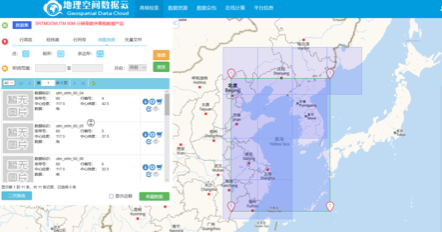
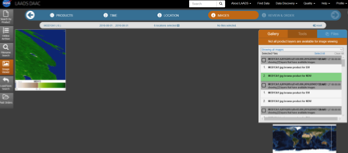

# 基础数据的获取和处理

> 中韩PM2.5传导关系的验证

## 数据需求说明

在本项目中，我们需要覆盖研究区域的以下自然环境信息：

* 气象数据：地面温度T, 地表气压P, 风速WindSpeed, 相对湿度RH

* 自然地理数据：NDVI（标准化植被指数）, DEM（数字高程模型）
* 区域地理信息（城市，行政区域和陆地边界等）

其中气象信息随着时间的推移会产生变化，存在着时空尺度上的差异，需要按照时间逐一来处理。而自然地理的情况在我们的研究时间范围内几乎没有变化，即不存在时间尺度上的差异。

## 数据来源和预处理

#### 区域地理信息

根据天地图上的

#### 气象数据

气象数据的来源为NCDC（美国国家气候数据中心，National Climatic Data Center），隶属于NOAA（美国国家海洋及大气管理局，National Oceanic and Atmospheric Administration）。

数据来自NCDC的公开FTP服务器[Link](ftp://ftp.ncdc.noaa.gov/pub/data/noaa/isd-lite/)。气象数据按照站点和年分文件保存。这些气象要素包含了气温、气压、露点温度、风向风速、云量、降水量等。我们按照数据的规格说明，编写Python小程序进行数据处理，形成按时间分别储存的研究区域范围内所有的气象站的测站得到的读数信息（一个文件/要素集包含了某一个时间所有测站的地理位置和读数）。

#### 自然地理数据

DEM数据来自[地理空间数据云](www.gscloud.cn)，经过重新裁剪和镶嵌，然后重采样选取和底图数据一样的栅格大小。



 NDVI数据来源来自NASA的地球数据目录。见于 MODIS 数据中的MOD13 数据机，其中 A1 为 NDVI 值。[Link](https://ladsweb.modaps.eosdis.nasa.gov/search/)数据经过裁剪镶嵌，重采样最终被代入AOD的计算公式中。




## 处理并获取覆盖地表的气象信息

根据Xintong Li和Qingqing He等的研究，我们选取以下变量进行处理和分析（这些变量并不一定用于建立PM2.5浓度的预测模型中）。

* 地表温度 (Surface Air Temperature, *T*)
* 露点温度 (Dew Point Temperature, *DT*)
* 相对湿度 (Relative Humidity, *RH*)
* 海平面气压 (Sea Level Air Pressure, *P*)
* 地表风速 (Wind Speed, *WS*)

其中，相对湿度的信息并没有在测站的读数中直接表达，而相对湿度取决于某一地点的T和DT。我们将按照物理学上对相对湿度的定义，利用测站获取的露点温度和气温气压，简单计算获得了相对湿度信息。

### 获取区域全覆盖的气象信息（插值）

 利用QGIS 3.8提供的的IDW工具，我们可以将研究区域内的点信息通过插值获得覆盖全面的气象信息。QGIS提供了Python IDE，名为PyQGIS，其中包括了`Processing`包，用于调用QGIS的空间处理组建。

我们利用这些信息，即可获得覆盖区域的气象信息。


## 附录 处理代码

### 1. 对气象站的原始信息进行处理

```python
import os
import csv
import re

dir = os.path.dirname(__file__)
datadir = os.path.join(dir, 'data')
outputDirectory = os.path.join(dir, 'output')
print(dir)
files = []
station_list = {}

with open('need.csv', newline='') as csvfile:
    station_list_csv = csv.reader(csvfile, delimiter=',', quotechar='\"')
    for row in station_list_csv:
        station_list[row[1]] = [row[7], row[8], row[9]]
del station_list['USAF']

weatherByHourList = []
for i in range(13, 19):    # day of date
    for j in range(0, 24, 3):
        fileName = ('201903{:0>2d}'.format(i) + '{:0>2d}').format(j)
        weatherByHourList.append(fileName)
        with open('output/' + fileName + '.csv', 'w', ) as file:
            file.write('USAF, lat, lon, ELEV, AirTemp, DewPointTemp, SeaLevelPressure, WindDirection, WindSpeedRate, SkyCondition, Precipitation\n')
            file.close()

for entry in os.listdir(os.path.join(dir, 'data')):
    usaf = entry.split('-')[0]
    fl = 0
    if usaf in station_list.keys():
        fl = 1
        coord = station_list[usaf]
        with open('data/' + entry) as file:
            tmp = file.readlines()
            for line in tmp:
                l = line.split()
                date = ''.join(l[:4])
                if date in weatherByHourList:
                    if l[6] == "-9999" or l[7] == "-9999":
                        continue
                    for iii in range (4, 12):
                        if l[iii] == "-9999":
                            l[iii] = ""
                    out_data = l[4:10]
                    out_data.append(l[11])
                    with open('output/' + date + '.csv', 'a+',) as f:
                        out = [usaf, station_list[usaf][0], station_list[usaf][1], station_list[usaf][2]] + out_data
                        f.write(','.join(out) + '\n')


print(station_list)
print(len(station_list))
```


