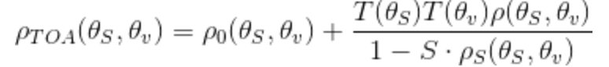
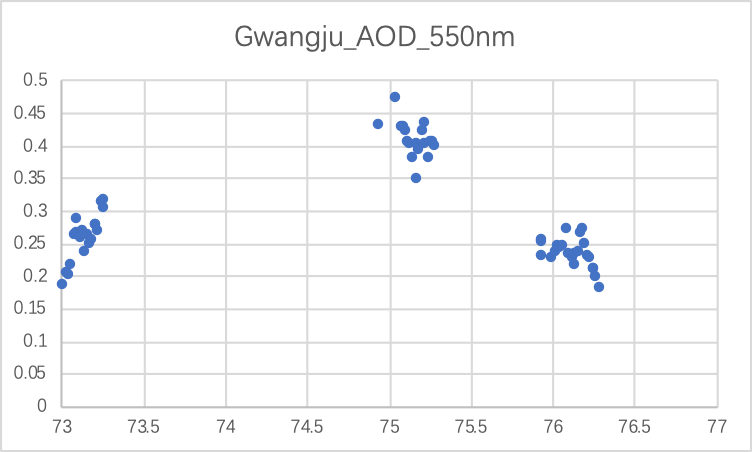
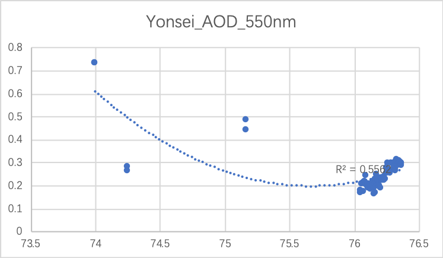
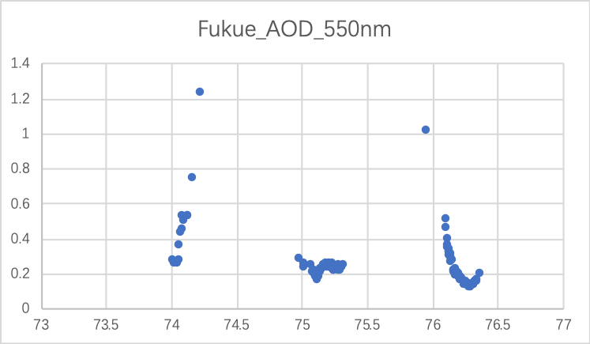

<h3 style="text-align:center">中韩PM2.5传导关系的验证</h3>
<h1 style="text-align:center; font-size:300%; padding-down:100%">基础数据的获取和处理</h1>
> 陈玮烨 孙克染 杨清杰 李岸洲

<h2 style="text-align:center">说明目录</h2>
[TOC]

---

## 一、数据需求说明

在本项目中，我们需要覆盖研究区域的以下自然环境信息：

* 气象数据：地面温度T, 地表气压P, 风速WindSpeed, 相对湿度RH
* 自然地理数据：NDVI（标准化植被指数）, DEM（数字高程模型）
* 区域地理信息（城市，行政区域和陆地边界等）
* 空气污染信息：PM2.5观测站数据
* 对地观测遥感卫星影像
  * 韩国GOCI海洋监测卫星
  * NASA提供的MODIS气溶胶产品（编号MYD04）

其中气象信息随着时间的推移会产生变化，存在着时空尺度上的差异，需要按照时间逐一来处理。而自然地理的情况在我们的研究时间范围内几乎没有变化，即不存在时间尺度上的差异。遥感卫星影像用于反演获取光学气溶胶厚度（**AOD**）。


## 二、数据来源和预处理

### 1. 区域地理信息

区域地理信息根据网络上的世界地图来获取。


本研究的研究区域是人为设定的，北端覆盖至朝鲜北部，南端覆盖至中国上海，西端延伸至中国苏州，东端覆盖至日本最西端。研究区域完美的覆盖了韩国全境、朝鲜大部分区域和中国东部部分关键区域和包含其中的海洋区域，可以完全支持中韩PM2.5传导关系的分析。

根据全球模式的风向流动[图示](https://earth.nullschool.net/)，我们可以看出，研究时间段内，从中国东部沿海地区向朝鲜半岛的风较多，因此我们在设定研究区域时多预留了中国东部沿海区域。


### 2. 气象数据

气象数据的来源为NCDC（美国国家气候数据中心，National Climatic Data Center），隶属于NOAA（美国国家海洋及大气管理局，National Oceanic and Atmospheric Administration）。

数据来自NCDC的公开FTP服务器[Link](ftp://ftp.ncdc.noaa.gov/pub/data/noaa/isd-lite/)。气象数据按照站点和年分文件保存。这些气象要素包含了气温、气压、露点温度、风向风速、云量、降水量等。我们按照数据的规格说明，编写Python小程序进行数据处理，形成按时间分别储存的研究区域范围内所有的气象站的测站得到的读数信息（一个文件/要素集包含了某一个时间所有测站的地理位置和读数）。


### 3. 自然地理数据

DEM数据来自[地理空间数据云](www.gscloud.cn)，经过重新裁剪和镶嵌，然后重采样选取和底图数据一样的栅格大小。


NDVI数据来源来自NASA的地球数据目录。见于 MODIS 数据中的MOD13 数据机，其中 A1 为 NDVI 值。[Link](https://ladsweb.modaps.eosdis.nasa.gov/search/)数据经过裁剪镶嵌，重采样最终被代入AOD的计算公式中。


### 4. 空气污染信息

通过Python等脚本处理信息源网页，将获取到的PM2.5数据按照时间整理为数据表格，每个表格包含了所有的监测点的坐标和PM2.5的值。

数据信息站点见[附录5](#5. 空气质量信息数据源)。


### 5. 对地观测遥感卫星影像

#### 5.1 GOCI海洋监测卫星说明

我们选取的影像数据是来源于韩国的GOCI海洋监测卫星，它是一个静止卫星，空间分辨率为500米。每天从1时至7时（UTC）每小时，会在固定区域进行遥感数据采集，每天7组影像数据。GOCI一级影像数据包含7个波段，每个波段对应不同的波长。

> （此处插入波段-波长表格）

通过GOCI官方提供的GDPS软件可以获取包括太阳天顶角、卫星天顶角、方位角、表观反射率、NDVI等2、3级产品。通过这些次级产品，我们就可以进行气溶胶光学厚度的反演了。

由于GOCI影响具有较高的时空分辨率，而且空间范围完全覆盖了我们选取的研究区域，有助于我们分析验证中韩之间的PM2.5传导具体过程。

其中412nm的蓝光波段反射率选取作为深蓝方法反演气溶胶光学厚度的……

> 似乎未完待续

#### 5.2 光学气溶胶厚度

首先我们需要明白我们的研究对象的定义，描述一个物质可以直接从它的组成上来描述：**云、雾、烟尘**，这些所有都算是，pm2.5只是其中很小的一部分。

NASA有提供直接的AOD产品——MYD04(550nm)。AOD除了和大气的组成直接相关外，还和光的波长有关。目前，MODIS II级气溶胶产品(MOD04/MYD04)是最适合近实时气溶胶数据同化的气溶胶光学厚度产品。

在本研究中，我们探寻使用韩国的GOCI的海洋监测卫星提供的影像和配置信息来反演气溶胶厚度。详细请见[第四节](#四、光学气溶胶厚度（AOD）的反演)。


## 三、气象输数据的预处理

### 1. 处理并获取覆盖地表的气象信息

#### 1.1 气象属性选择

根据Xintong Li和Qingqing He等的研究，我们选取以下变量进行处理和分析（这些变量并不一定用于建立PM2.5浓度的预测模型中）。

* 地表温度 (Surface Air Temperature, *T*)
* 露点温度 (Dew Point Temperature, *DT*)
* 相对湿度 (Relative Humidity, *RH*)
* 海平面气压 (Sea Level Air Pressure, *P*)
* 地表风速 (Wind Speed, *WS*)

其中，相对湿度的信息并没有在测站的读数中直接表达，而相对湿度取决于某一地点的T和DT。我们将按照物理学上对相对湿度的定义，利用测站获取的露点温度和气温气压，简单计算获得了相对湿度信息。

#### 1.2 获取区域全覆盖的气象信息（插值）

利用QGIS 3.8提供的的IDW工具，我们可以将研究区域内的点信息通过插值获得覆盖全面的气象信息。QGIS提供了Python IDE，名为PyQGIS，其中包括了`Processing`包，用于调用QGIS的空间处理组建。

利用空间插值方法，和气象信息这些信息，即可获得覆盖区域的气象信息。空间插值主要有三种常见的方法，一种是IDW，另外即是克里金法 (Krigging)、样条插值 (Spline Interpolation)。在本实验中，我们采用反距离加权法。

##### Inverse Distance Weighting Interpolation

反距离加权(IDW)方法是一种确定性的空间插值模型，由于在许多GIS包中得到了实现，是目前地球科学工作者和地理学家广泛采用的方法之一。该方法的一般前提是任意给定一对点的属性值是相互关联的，但它们的相似度与两个位置之间的距离成反比。

然而，许多研究，特别是在空间相互作用的文献中，已经揭示了任何两个地点之间空间关系的下降并不仅仅与距离成正比。所以，距离的幂函数和指数函数常常被用于表示空间上地点之间的关联。应用IDW时，这类方程经常被用于预测确定地点的不确定要素值。

但是IDW也有一些缺陷，例如IDW的权重系数取决于一个固定的值 (priori) 而非根据实验和经验决定的。另外IDW不能预测没有样本数值的地点的值的方差。另外距离衰减参数 (distance-decay parameter) 在整个研究平面内都是均匀的，不考虑样本的数值的分布——换句话说，标准的IDW认为距离衰减在在空间中都是表现出一样的性质，但这不一定符合实际。相对而言，IDW提供的结果不够准确。

### 2. 将气象信息和PM2.5观测站点进行空间关联

首先使用PyQGIS将所有的文本数据表格（csv文件）组织成地理信息系统支持的文件（shapefile）[附录4](#4. 将逗号分隔文本表格转化为地理信息系统支持的Shapefile)。然后使用QGIS提供的Add Raster Value to Point工具将之前获得的空间插值后的覆盖研究区域的气象数据空间关联到之前的shapefile中即可。


## 四、光学气溶胶厚度（AOD）的反演

### 1. 反演的核心思想

地表反射 + 大气反射 = 表观反射，也就是很多人说的地气解耦。



$\rho_{TOA}$是表观反射率，$\rho_{s}$是地表反射率，其余的是与大气相关参数。

其中地表反射率还有一个公式：
$$
\rho_{TOA}=\frac{\pi{L_{\lambda}}D^2}{ESUN_{\lambda}cos\theta}
$$
其中D是天文单位的日地距离，恰巧日地距离就是一个天文单位。 $L_\lambda$是经过辐射校正之后的辐亮度，任何卫星应该在拍摄的时候记录下来gain和bias的数值，就是一个线性的变换。$\theta$是太阳天顶角，也是卫星元数据的一部分。$ESUN_{\lambda}$是大气顶部的太阳辐照度值，是波长的函数，有论文指出了我们需要用到的波段的该值。通过此公式，我们即可由遥感原始数据的DN值推导出表观反射率。

NASA介绍深蓝算法时，曾有如下一段说明：“在可见光的许多波长下，气溶胶和地表之间的对比很难分辨，但在412纳米波段——“深蓝”波段，气溶胶信号往往是明亮的，而表面特征是黑暗的。”

> At many wavelengths of visible light, the contrast between aerosols and the surface is difficult to discern, but in the 412 nm band - the "deep blue" band, aerosol signals tend to be bright and surface features dark.
>
> ***NASA***

根据以上事实，我们的表观反射率的数据选择为GOCI的412nm（第一波段），在此波段下的分子散射和吸收都远远的低于其它波段，故气溶胶垂直廓线的影响对深蓝波段气溶胶光学厚度反演的影响甚微。在这里我们运用的地表反射率产品直接是MYD09。其次，当地表反射率较小时，卫星观测到的表观反射率与气溶胶光学厚度有着很好的线性相关性。且蓝波段的敏感度很大：蓝波段地表反射率的分布比较集中，80%介于0～0.1之间，60%小于0.05，只有10%高于0.2。对于MYD09的数据，我们只需剔除那些高于0.1的数值。

在大气科学领域还有一个6S模型用于描述大气参数与AOD数值的关系，所以最终我们是通过查表获得最贴切的AOD数值。

### 2. 验证

NASA有相关的监测站专门测量AOD述职，以及他们有MYD04的产品直接是AOD的栅格，可以用作检验反演算法的有效性。

另外，我们采用AERONET的信息对反演获得的AOD信息进行回归分析处理。AERONET为气溶胶研究鉴定、卫星反演的验证、与其他数据库的协同，提供了长期连的、易获取的气溶胶光学、微观物理学以及辐射特性。该地区范围内可用检测站即在测量时间范围内有数据的检测站有4个，其中韩国境内3个，中国境内1个。

AERONET采集数据的仪器为CIMEL CE318多波段太阳光度计。该仪器在可见和近红外波段均有8 个光谱通道（极化式通道有：1020、870、675、440、936、870P1、870P2、870P3，P1、P2和P3为三个极化通道；普通式的通道有：1020、870、675、500、440、380、340、936），其中并无深蓝法反演AOD所得到的550nm出的数据。通过440nm波段和675nm波段处的数据，根据公式以下公式计算出550nm出的AOD数据。
$$
τ(λ)=k⋅\lambda^{−v+2}
$$
将这550nm的数据同反演得到的AOD数据进行线性回归。



 


注：AERONET数据的横坐标表示观测时间在一年中的第几天，反演AOD横坐标为14-16的九组数据

通过AERONET测量的4个不同的站点得到的数据为73-77的测量时间段，即3月14到3月17号，AOD反演的数据是取AERONET测量站点周围5km范围内的所有栅格反演所得到的AOD数据，所测量的时间段为3月14，15，16号的每日1点4点7点时间共计九个时间段。

反演所得到的AOD数据仅在Gwangju地区同AERONET站点数据变化趋势十分相近。

在Yonsei地区由于AERONET站点所测量的数据过少，数据之间无法形成良好的线性关系，但是在76日即3月16日末3月17日初，AOD数据很低，这和反演所得到的数据相似。

在Beijing站点周围的AERONET数据同样能反映出测量时间内AOD数据有着先增后减的趋势，并在数值上同卫星反演的AOD数据相近。

Fukue地区也同样反映出测量时间内，AOD数据先增后减的趋势，但是由于AERONET数据最高点时，反演的AOD无数据。

结果表明，在Gwangju地区，反演的AOD数据与实际值更加相似。总体上，反演所得到的结论部分数据同AERONET数据相符，趋势相符。


## 附录 处理代码

### 1. 对气象站的原始信息进行处理

使用Python对气象站原始信息进行整理，获得按时刻整理的csv文件组，每一个csv文件存放了研究区域内所有的气象站在对应的时刻的气象信息读数。

```python
import os
import csv
import re

dir = os.path.dirname(__file__)
datadir = os.path.join(dir, 'data')
outputDirectory = os.path.join(dir, 'output')
print(dir)
files = []
station_list = {}

with open('need.csv', newline='') as csvfile:
    station_list_csv = csv.reader(csvfile, delimiter=',', quotechar='\"')
    for row in station_list_csv:
        station_list[row[1]] = [row[7], row[8], row[9]]
del station_list['USAF']

weatherByHourList = []
for i in range(13, 19):    # day of date
    for j in range(0, 24, 3):
        fileName = ('201903{:0>2d}'.format(i) + '{:0>2d}').format(j)
        weatherByHourList.append(fileName)
        with open('output/' + fileName + '.csv', 'w', ) as file:
            file.write('USAF, lat, lon, ELEV, AirTemp, DewPointTemp, SeaLevelPressure, WindDirection, WindSpeedRate, SkyCondition, Precipitation\n')
            file.close()

for entry in os.listdir(os.path.join(dir, 'data')):
    usaf = entry.split('-')[0]
    fl = 0
    if usaf in station_list.keys():
        fl = 1
        coord = station_list[usaf]
        with open('data/' + entry) as file:
            tmp = file.readlines()
            for line in tmp:
                l = line.split()
                date = ''.join(l[:4])
                if date in weatherByHourList:
                    if l[6] == "-9999" or l[7] == "-9999":
                        continue
                    for iii in range (4, 12):
                        if l[iii] == "-9999":
                            l[iii] = ""
                    out_data = l[4:10]
                    out_data.append(l[11])
                    with open('output/' + date + '.csv', 'a+',) as f:
                        out = [usaf, station_list[usaf][0], station_list[usaf][1], station_list[usaf][2]] + out_data
                        f.write(','.join(out) + '\n')


print(station_list)
print(len(station_list))
```


### 2. 使用QGIS完成空间插值

使用PyQGIS提供的processing库，调用IDW空间插值的API实现插值。

```python
import os, processing, glob

extent = QgsRectangle()
extent.setXMinimum(-1225788.7785473763942719)
extent.setYMinimum(-639571.7029640320688486)
extent.setXMaximum(53952.0980498259887099)
extent.setYMaximum(685123.5293848998844624)
rect = extent
print(rect)

AirTempPath = "/Users/robert/Codings/2019/neasianaq/a/AirTemp/"
WindSpeedPath = "/Users/robert/Codings/2019/neasianaq/a/WindSpeed/"
SeaLevelPrPath = "/Users/robert/Codings/2019/neasianaq/a/SeaLevelPr/"
WindDirectionPath = "/Users/robert/Codings/2019/neasianaq/a/WindDirection/"

attrDict = {
    "AirTemp": 4,
    "SeaLevelPr": 6,
    "WindDir": 7,
    "WindSpeed": 8
}

pathDict = {
    "AirTemp": AirTempPath,
    "SeaLevelPr": SeaLevelPrPath,
    "WindDir": WindDirectionPath,
    "WindSpeed": WindSpeedPath
}

layersList = QgsProject.instance().mapLayers()
print(layersList)

flag = 1

for layername in layersList:
    lyr = layersList[layername] 
    print(lyr.name())
    if flag != 1:
        break
    if lyr.name().find("2019") != -1:
        flag = 2
        for attr in attrDict:
            layer_data=QgsInterpolator.LayerData()
            layer_data.source = lyr
            layer_data.zCoordInterpolation=False
            layer_data.interpolationAttribute = attrDict[attr] #Field
            layer_data.sourceType = 0 #points

            idw_interpolator = QgsIDWInterpolator([layer_data])
            idw_interpolator.setDistanceCoefficient(2.5)
            # export_path = AirTempPath + lyr.name() + "_AirTemp.tif"
            export_path = pathDict[attr] + lyr.name() + "_" + attr + ".tif"
            
            output = QgsGridFileWriter(idw_interpolator, export_path, rect, 750, 725)
            print(output)
            output.writeFile()
```


### 3. 计算覆盖地表的相对湿度

利用物理公式，获得相对湿度信息。

```python
from osgeo import gdal
import math
import numpy as np

class Grid(object):
    def read_img(self, _file):
        # print (_file)
        dataset = gdal.Open(_file)
        # 数据描述
        print(dataset.GetDescription())

        # 图像的列数X与行数Y
        img_width = dataset.RasterXSize
        img_height = dataset.RasterYSize

        # 仿射矩阵
        img_geotrans = dataset.GetGeoTransform()

        # 投影
        img_proj = dataset.GetProjection()

        # 将数据写成数组，对应栅格矩阵
        img_data = dataset.ReadAsArray(0, 0, img_width, img_height)

        # 数据格式大小
        print(img_data.shape)

        del dataset
        return img_data, img_proj, img_geotrans #, img_width, img_height

    def write_img(self, _file, img_data, img_proj, img_geotrans, _format):
        # 判断栅格数据的数据类型
        if 'int8' in img_data.dtype.name:
            datatype = gdal.GDT_Byte
        elif 'int16' in img_data.dtype.name:
            datatype = gdal.GDT_UInt16
        else:
            datatype = gdal.GDT_Float32

        # 判读数组维数
        if len(img_data.shape) == 3:
            img_bands, img_height, img_width = img_data.shape
        else:
            img_bands, (img_height, img_width) = 1, img_data.shape

        # 创建文件
        # HFA -> .img | GTiff -> .tif
        if _format == 'tif':
            driver = gdal.GetDriverByName("GTiff")
        else:
            driver = gdal.GetDriverByName("HFA")

        dataset = driver.Create(_file, img_width, img_height, img_bands, datatype)

        # 写入仿射变换参数
        dataset.SetGeoTransform(img_geotrans)
        # 写入投影
        dataset.SetProjection(img_proj)
        # 写入数组数据
        # GetRasterBand()
        if img_bands == 1:
            dataset.GetRasterBand(1).WriteArray(img_data)
        else:
            for i in range(img_bands):
                dataset.GetRasterBand(i + 1).WriteArray(img_data[i])

        del dataset


AirTPath = '/Users/robert/Codings/2019/neasianaq/a/Weather_Interpolated/AirTemp/'
DPoTPath = '/Users/robert/Codings/2019/neasianaq/a/Weather_Interpolated/DPTemp/'
RHPath = '/Users/robert/Codings/2019/neasianaq/a/Weather_Interpolated/RH/'

T_airList = []
T_dpoList = []

# a = 6.11
# b = 17.67
# c = 257.14
# d = 234.5
e = math.e

# def flattenImageArray(ImageArray, Width, Height)

grid = Grid()

# -------- Getting the lists ready -------
for i in range(13, 19):    # day of date
    for j in range(0, 24, 3):
        dateTime = ('201903{:0>2d}'.format(i) + '{:0>2d}').format(j)
        AFileName = dateTime + '_proj_AirTemp.tif'
        DFileName = dateTime + '_proj_DPTemp.tif'
        # T_airList.append(AFileName)
        # T_dpoList.append(DFileName)

        Ta, aProj, aGeoTrans = grid.read_img(AirTPath + AFileName)
        Td, dProj, dGeoTrans = grid.read_img(DPoTPath + DFileName)

        Ta = Ta/10
        Td = Td/10
        a = (5.0/9.0)*(Ta-32.0)
        b = (5.0/9.0)*(Td-32.0)
        c = 6.11 * np.power(10, (7.5*a/(237.7+a)))
        d = 6.11 * np.power(10, (7.5*b/(237.7+b)))
        RH = (d/c)*100

        # # Ta = gdal.Open(AirTPath + AFileName).ReadAsArray()
        # # Td = gdal.Open(DPoTPath + DFileName).ReadAsArray()
        # exponent = (d * Td)/(c + Td) - (b - Ta/d) * (Ta / (e + Ta))
        # print(exponent)
        # RH = 100 * np.power(e, exponent)
        print(RH)

        RHFileName = dateTime + '_proj_RH.tif'
        grid.write_img(RHPath + RHFileName, RH, aProj, aGeoTrans, 'tif')

        print("Calculation of Relative Humidity for " + dateTime + " is done.")
```


### 4. 将逗号分隔文本表格转化为地理信息系统支持的Shapefile

使用QGIS的processing库，遍历储存数据表格文件的文件夹并使用QGIS进行转换。

```python
import glob, os, processing

path_to_csv = "/Users/robert/Codings/2019/neasianaq/a/output/"
shape_result = "/Users/robert/Codings/2019/neasianaq/a/shps/"  # Change path to where you want the shapefiles saved

os.chdir(path_to_csv)  # Sets current directory to path of csv files
for fname in glob.glob("*.csv"):  # Finds each .csv file and applies following actions
        uri = "file:///" + path_to_csv + fname + "?delimiter=%s&crs=epsg:4326&xField=%s&yField=%s" % (",", "lon", "lat")
        name = fname.replace('.csv', '')
        lyr = QgsVectorLayer(uri, name, 'delimitedtext')
        output_name = shape_result + name + ".shp"
        QgsVectorFileWriter.writeAsVectorFormat(lyr, output_name,"utf-8", QgsCoordinateReferenceSystem("EPSG:4326"), "ESRI Shapefile", False)

for fname in glob.glob("*.shp"):
    uri = "file:///" + shape_result + fname
    name = fname.replace('.shp', '')
    lyr = QgsVectorLayer(uri, name)
```


### 5. 空气质量信息数据源

空气质量信息数据源来自以下信息源：

- [The World Air Quality Project](http://aqicn.org) 全球大城市一年的历史数据可见
- [中国空气质量在线监测分析平台](http://www.aqistudy.cn/)
- [中国AQI历史数据](http://beijingair.sinaapp.com/)
- [Berkeley Earth](http://berkeleyearth.lbl.gov/air-quality/local/South_Korea/Seoul) 韩国AQI历史小时数据
- [中国天气后报](http://www.tianqihoubao.com/aqi/) 
- [中国网友0](https://www.gracecode.com/aqi.html)
- [移动端AQI API](https://air-matters.com/)


### 6. GOCI Level 2 数据产品说明

#### 6.1 产品列表

下面列出GOCI所有提供的产品，其中加粗的项目是我门需要的产品

- L1B（原始数据，即下载的数据）
  - DN值，8个波段
- L2A
  - **RRS 遥感反射率（表观反射率），8个波段，单位$sr^{-1}$**
  - KD490 下行辐照度的扩散衰减系数（太阳能被扩散到海水深处的程度），1个波段
  - CDOM 溶解在水中的有机质的量，1个波段
  - CHL 海水中浮游植物的叶绿素浓度，1个波段
  - RI 赤潮指数（赤潮产生的程度），1个波段
  - VIS 水下能见度范围（水域的清澈程度），1个波段
  - TSS （海水中）总悬浮沉积物，1个波段
  - **DUST_AOT  黄尘——气溶胶光学厚度，1个波段**
  - DUST_FMF 五模式数值，表示气溶胶特性，用于检测海洋中的黄沙，1个波段
  - **LAND_NDVI 陆地归一化植被指数，1个波段**
  - LAND_EVI 陆地增强型植被指数，1个波段
  - FLAG 标志信息，作为大气校正结果的每个像素的状态，1个波段
- L2B
  - A 水的光学性质系数——吸收系数，400nm~500nm，5个波段
  - BB 水的光学性质系数——反向散射系数，400nm~500nm，5个波段
  - FLAG 标志信息，作为大气校正结果的每个像素的状态，1个波段
- L2C
  - Rayleigh Corrected Reflectance 经过瑞利校正后的反射率，8个波段
  - FLAG 标志信息，作为大气校正结果的每个像素的状态，1个波段
- L2P
  - **PHV 卫星方位角，1个波段，单位角度**
  - **THV 卫星天顶角，1个波段，单位角度**
  - **SOLA 太阳方位角，1个波段，单位角度**
  - **SOLZ 太阳天顶角，1个波段，单位角度**
  - FLAG 标志信息，作为大气校正结果的每个像素的状态，1个波段

#### 6.2 研究的时间尺度内对应的GOCI产品的可用性评价

- 2019-2-22：全天中国东南沿海和韩国大部被云层覆盖，中国东北和朝鲜地区略好，总体上完全不可用。
- 2019-2-23：全天部分时段研究区域有少量浮云，可以采用。
- 2019-2-24：早些时候气候条件比较理想，可以采用。
- 2019-2-25：中午有少量浮云，可以采用。
- 2019-2-26：中国东南沿海始终有云层覆盖，其他区域天气条件适宜，不建议采用。
- 2019-2-27：云层覆盖严重，几乎不可用。
- 2019-2-28：有浮云，效果不理想，勉强采用。
- 2019-3-1：天气条件优秀，可以采用。
- 2019-3-2：中国东南沿海附近云层覆盖严重，其余地方较好。
- 2019-3-3：云层密布，无法采用。
- 2019-3-4：浮云比较多，不建议采用。
- 2019-3-5：云层密布，无法采用。
- 2019-3-6：晚间云层比较稀疏，勉强可以使用。
- 2019-3-7：晚间云层较少，可以采用。
- 2019-3-8：天气条件特别好，可以采用。
- 2019-3-9：云层密布，无法采用。
- 2019-3-10：云层密布，完全不能采用。
- 2019-3-11：韩国区域有少量云层，勉强可以采用。
- 2019-3-12：韩国和山东半岛有部分云层覆盖，勉强可以采用。
- 2019-3-13：早上效果很好，可以采用。
- 2019-3-14：天气条件极佳，可以采用。
- 2019-3-15：朝鲜半岛有大面积云层覆盖，很难使用。
- 2019-3-16：朝鲜半岛有部分云层覆盖，勉强使用。
- 2019-3-17：朝鲜半岛有少量云层覆盖，可以采用。
- 2019-3-18：朝鲜半岛南部和中国东南沿海被云层覆盖，无法采用。
- 2019-3-19：天气条件极佳，可以采用。
- 2019-3-20：云层密布，完全无法使用。
- 2019-3-21：云层覆盖变化，经过繁琐处理之后或可使用。
- 2019-3-22：中午及晚间天气条件良好，可以采用。
- 2019-3-23：早上天气不错，可以采用。
- 2019-3-24：天气条件极佳，可以采用。
- 2019-3-25：朝鲜半岛有云层始终覆盖，可用性不高。
- 2019-3-26：云层稀疏，可以采用。
- 2019-3-27：云层较薄，勉强采用。
- 2019-3-28：云层较薄，不建议采用。
- 2019-3-29：零散的云层，勉强使用。
- 2019-3-30：朝鲜半岛云层覆盖比较严，基本无法使用。
- 2019-3-31：朝鲜半岛云层覆盖比较严，基本无法使用。


### 7. 气溶胶反演程序

#### 7.1 使用深蓝算法获取AOD

```python
"""
Author: 李岸洲
AOD retrieval algorithm: Deep Blue
==================================
input data:
---
1 GOCI::band1(412nm)
2 SOLZ::solar zenith angle
3 MODIS09::band3
4 cloud_mask
5 LUT::6S model

output:
---
each hour's AOD
"""


from osgeo import gdal
import numpy as np
import matplotlib.pyplot as plt
from argparse import ArgumentParser, ArgumentDefaultsHelpFormatter
import sys
import time
import datetime
import multiprocessing


__author__ = "Andrian Lee"
__date__ = "2019/07/14"


class Grid(object):
    def read_img(self, _file):
        dataset = gdal.Open(_file)
        # 数据描述
        print(dataset.GetDescription())

        # 图像的列数X与行数Y
        img_width = dataset.RasterXSize
        img_height = dataset.RasterYSize

        # 仿射矩阵
        img_geotrans = dataset.GetGeoTransform()

        # 投影
        img_proj = dataset.GetProjection()

        # 将数据写成数组，对应栅格矩阵
        img_data = dataset.ReadAsArray(0, 0, img_width, img_height)

        # 数据格式大小
        print(img_data.shape)

        del dataset
        return img_data, img_proj, img_geotrans

    def write_img(self, _file, img_data, img_proj, img_geotrans, _format):
        # 判断栅格数据的数据类型
        if 'int8' in img_data.dtype.name:
            datatype = gdal.GDT_Byte
        elif 'int16' in img_data.dtype.name:
            datatype = gdal.GDT_UInt16
        else:
            datatype = gdal.GDT_Float32

        # 判读数组维数
        if len(img_data.shape) == 3:
            img_bands, img_height, img_width = img_data.shape
        else:
            img_bands, (img_height, img_width) = 1, img_data.shape

        # 创建文件
        # HFA -> .img | GTiff -> .tif
        if _format == 'tif':
            driver = gdal.GetDriverByName("GTiff")
        else:
            driver = gdal.GetDriverByName("HFA")

        dataset = driver.Create(_file, img_width, img_height, img_bands, datatype)

        # 写入仿射变换参数
        dataset.SetGeoTransform(img_geotrans)
        # 写入投影
        dataset.SetProjection(img_proj)
        # 写入数组数据
        # GetRasterBand()
        if img_bands == 1:
            dataset.GetRasterBand(1).WriteArray(img_data)
        else:
            for i in range(img_bands):
                dataset.GetRasterBand(i + 1).WriteArray(img_data[i])

        del dataset


def LUT_read(_file):
    f = open(_file)
    lines = f.readlines()
    f.close()
    res = []
    for line in lines:
        line = [float(x) for idx, x in enumerate(line.strip().split()) if idx in [0, 1, 2, 6]]
        res.append(line)
    return res


def AOD_Deepblue(data, _file, mod09, cloud):
    lut = LUT_read(_file)
    row, col = data.shape[0], data.shape[1]
    tot = row * col

    # Choose the qualified deep_blue area
    data, cnt_np = choose_db_cloud(data, mod09, cloud)
    print("To be processed", tot - cnt_np, "/", tot)

    print('DB start time', time.strftime('%Y-%m-%d %H:%M:%S', time.localtime(time.time())))
    pool = multiprocessing.Pool()
    cpus = multiprocessing.cpu_count()
    num_process = int(cpus * 0.9)
    results = []
    for _iter in range(num_process):
        results.append(pool.apply_async(get_aod, args=(_iter, row, num_process, data, lut, mod09)))
    pool.close()
    pool.join()

    aod_dict = {}
    for result in results:
        aod_dict.update(result.get())

    out_aod = []
    for k in sorted(aod_dict):
        out_aod.append(aod_dict[k])
    out_aod = np.array(out_aod)

    return out_aod


def get_aod(start_pos, end_pos, step_size, data, lut, mod09):
    """Sub-process for parallel processing on AOD retrieval"""
    out = {}

    print('Process'+str(start_pos), 'started...')
    for idi in range(start_pos, end_pos, step_size):  # load balancing
        aod = np.zeros(data.shape[1])  # col

        _start = datetime.datetime.now()
        for idj, j in enumerate(data[idi]):
            if j != 0.0 and j != -1.0:  # ignore mask and nodata
                aod_v = LUT_match(data, lut, idi, idj, mod09)  # 0.02s for 0.1 step-wise 6s-LUT each pixel
                aod[idj] = aod_v
        _end = datetime.datetime.now()
        print('Process'+str(start_pos), str(idi)+'-th row finished, time cost:', _end - _start, time.ctime())

        out.update({idi: aod})
    print('Process'+str(start_pos), 'ended...')

    return out


def choose_db_cloud(data, mod09, cloud):
    """
        nodata -> -1.0
        db, cloud(mask) -> 0.0
    """
    nodata = np.min(data)
    nodata_index = data == nodata
    data[nodata_index] = -1.0

    mask_db = mod09 > 0.1
    data[mask_db] = 0.0

    mask_cloud = cloud == 1
    data[mask_cloud] = 0.0

    num_nodata = np.count_nonzero(nodata_index)
    num_mask = np.count_nonzero(mask_db)
    num_cloud = np.count_nonzero(mask_cloud)

    return data, num_nodata+num_mask+num_cloud


def LUT_match(data, lut, idi, idj, mod09):
    """look up table"""
    p_aot1 = data[idi][idj]   # band 3
    p_sur = mod09[idi][idj]      # mod09

    min_d = 100
    aod_v = 0
    for i in lut:
        p_aot2 = i[2] + (i[1] * p_sur) / (1 - i[0] * p_sur)
        _delta = abs(p_aot2 - p_aot1)
        if _delta < min_d:
            aod_v = i[3]
            min_d = _delta
    return aod_v


def Fast_interpolate(aod, data):
    """Interpolate the mask area -> 0.0"""
    row, col = aod.shape[0], aod.shape[1]
    _eps = 1e-4
    for idi, i in enumerate(aod):
        print('interpolate', idi)
        for idj, j in enumerate(i):
            if data[idi][idj] == 0.0:
                # assign range
                # print('interpolate', idi, idj)
                x = 1
                while True:
                    flag = 0
                    for t in range(idj-x, idj+x+1):
                        if 0 <= t < col:
                            if idi - x >= 0 and aod[idi-x][t] > _eps:
                                flag = 1
                                break
                            if idi + x < row and aod[idi+x][t] > _eps:
                                flag = 1
                                break
                    for t in range(idi-x, idi+x+1):
                        if 0 <= t < row:
                            if idj - x >= 0.0 and aod[t][idj-x] > _eps:
                                flag = 1
                                break
                            if idj + x < col and aod[t][idj+x] > _eps:
                                flag = 1
                                break
                    if flag == 1:
                        break
                    x += 1
                # print(x)

                # calculate meansh
                cnt = 0
                tot = 0
                for t in range(idj-x, idj+x+1):
                    if 0 <= t < col:
                        if idi - x >= 0 and aod[idi - x][t] > _eps:
                            tot += aod[idi - x][t]
                            cnt += 1
                        if idi + x < row and aod[idi + x][t] > _eps:
                            tot += aod[idi + x][t]
                            cnt += 1
                for t in range(idi-x+1, idi+x):
                    if 0 <= t < row:
                        if idj - x >= 0.0 and aod[t][idj - x] > _eps:
                            tot += aod[t][idj - x]
                            cnt += 1
                        if idj + x < col and aod[t][idj + x] > _eps:
                            tot += aod[t][idj + x]
                            cnt += 1
                if cnt == 0:
                    print("strange:", idi, " ", idj)
                    print("x", x)
                else:
                    aod[idi][idj] = tot / cnt
    return aod


def preprocess_GOCI(data, solz):
    """ DN -> apparent reflectance"""

    _ESUN = 1796.65  # GOCI::band_421nm
    _D = 1
    gain = 1e-6
    bias = 0

    data = (data * gain + bias) * (_D * _D) * np.pi / _ESUN
    nodata = np.min(data)
    tmp = np.where(data != nodata)  # index
    data[tmp] / np.cos(solz[tmp]*np.pi/180)

    return data


def main():
    parser = ArgumentParser("aod_retrieval", formatter_class=ArgumentDefaultsHelpFormatter, conflict_handler='resolve')
    parser.add_argument('--goci')
    parser.add_argument('--solz')
    parser.add_argument('--myd09')
    parser.add_argument('--cloud')
    parser.add_argument('--lut')
    parser.add_argument('--output')
    args = parser.parse_args()

    run = Grid()

    raster_toa = args.goci
    data, proj, geotrans = run.read_img(raster_toa)

    raster_solz = args.solz
    solz, proj_solz, geotrans_solz = run.read_img(raster_solz)

    data = preprocess_GOCI(data, solz)

    raster_surface = args.myd09  # nodata: -INFINITE, max:0.77
    mod09, proj1, geotrans1 = run.read_img(raster_surface)

    raster_cloud = args.cloud
    cloud, proj_cloud, geotrans_cloud = run.read_img(raster_cloud)

    lut_filepath = args.lut

    # multi-process
    out_data0 = AOD_Deepblue(data, lut_filepath, mod09, cloud)

    out_name = ['aod']
    out_name += raster_toa.split('/')[-1][:-4].split('-')[1:]
    out_name = '-'.join(out_name)
    out_file0 = args.output + out_name + '_tmp.tif'
    run.write_img(out_file0, out_data0, proj, geotrans, 'tif')
    print('AOD retrieval finished!!!!')
    plt.imshow(out_data0)
    plt.savefig(args.output + out_name + '_tmp_thumb.png')

    out_file1 = args.output + out_name + '_origin.tif'
    run.write_img(out_file1, data, proj, geotrans, 'tif')

    _start = datetime.datetime.now()
    out_data = Fast_interpolate(out_data0, data)
    _end = datetime.datetime.now()
    print('Interpolate time cost:', _end - _start)

    out_file2 = args.output + out_name + '.tif'
    run.write_img(out_file2, out_data, proj, geotrans, 'tif')


    plt.imshow(data)
    plt.savefig(args.output + out_name + '_origin_thumb.png')
    plt.imshow(out_data)
    plt.savefig(args.output + out_name + '_thumb.png')


if __name__ == "__main__":
    sys.exit(main())
```


#### 7.2 Shell命令使用方法

Example

```shell
python aod_retrieval_db.py --goci ../aod_retrieval_data/L1B1_land/L1B1_land-14-1.tif --solz ../aod_retrieval_data/SOLZ_land/SOLZ_land-14-1.tif --myd09 ../aod_retrieval_data/MYD09/MYD09A1-project1.tif --cloud ../aod_retrieval_data/cloud_land/cloud_land-14-1.tif --lut ../aod_retrieval_data/LUT/modis_lut_m.txt --output ../aod_retrieval_res/
```


### Reference 参考资料

1. George Y. Lu, David W. Wong,
   An adaptive inverse-distance weighting spatial interpolation technique,
   Computers & Geosciences,
   Volume 34, Issue 9,
   2008,
   Pages 1044-1055,
   ISSN 0098-3004,
   https://doi.org/10.1016/j.cageo.2007.07.010.
2. 